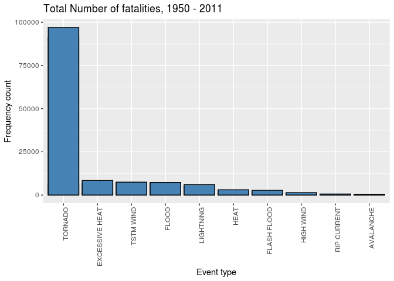
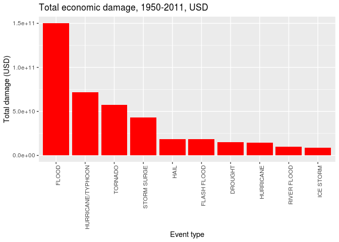

1. Questions & Answers
----------------------

-   Across the United States, which types of events (as indicated in the
    EVTYPE variable) are most harmful with respect to population health?
    -   **Tornados have caused greated number of fatalities (5,633) and
        injuries (91,347)**
-   Across the United States, which types of events have the greatest
    economic consequences?
    -   **Floods have caused the most significant damage 144.7 Billion
        USD, followd by HURRICANE/TYPHOON with 69.3 Billion USD damage**

2. Data Processing
------------------

### 2.1 Environment

    setwd("~/Soft/Rtest/datasciencecoursera/05_Reproducible_Research/")
    library("data.table")
    library("ggplot2")

### 2.2 Data download

    # defile the url
    #fileUrl <- "https://d396qusza40orc.cloudfront.net/repdata%2Fdata%2FStormData.csv.bz2"
    # download the file into ./data/
    #download.file(fileUrl, destfile = "./data/repdata_data_StormData.csv.bz2")

read the `csv.bz2` file, rename as `storm`

    # load data frame
    storm <- read.csv("./data/repdata_data_StormData.csv.bz2")
    head(storm)

    ##   STATE__           BGN_DATE BGN_TIME TIME_ZONE COUNTY COUNTYNAME STATE  EVTYPE
    ## 1       1  4/18/1950 0:00:00     0130       CST     97     MOBILE    AL TORNADO
    ## 2       1  4/18/1950 0:00:00     0145       CST      3    BALDWIN    AL TORNADO
    ## 3       1  2/20/1951 0:00:00     1600       CST     57    FAYETTE    AL TORNADO
    ## 4       1   6/8/1951 0:00:00     0900       CST     89    MADISON    AL TORNADO
    ## 5       1 11/15/1951 0:00:00     1500       CST     43    CULLMAN    AL TORNADO
    ## 6       1 11/15/1951 0:00:00     2000       CST     77 LAUDERDALE    AL TORNADO
    ##   BGN_RANGE BGN_AZI BGN_LOCATI END_DATE END_TIME COUNTY_END COUNTYENDN
    ## 1         0                                               0         NA
    ## 2         0                                               0         NA
    ## 3         0                                               0         NA
    ## 4         0                                               0         NA
    ## 5         0                                               0         NA
    ## 6         0                                               0         NA
    ##   END_RANGE END_AZI END_LOCATI LENGTH WIDTH F MAG FATALITIES INJURIES PROPDMG
    ## 1         0                      14.0   100 3   0          0       15    25.0
    ## 2         0                       2.0   150 2   0          0        0     2.5
    ## 3         0                       0.1   123 2   0          0        2    25.0
    ## 4         0                       0.0   100 2   0          0        2     2.5
    ## 5         0                       0.0   150 2   0          0        2     2.5
    ## 6         0                       1.5   177 2   0          0        6     2.5
    ##   PROPDMGEXP CROPDMG CROPDMGEXP WFO STATEOFFIC ZONENAMES LATITUDE LONGITUDE
    ## 1          K       0                                         3040      8812
    ## 2          K       0                                         3042      8755
    ## 3          K       0                                         3340      8742
    ## 4          K       0                                         3458      8626
    ## 5          K       0                                         3412      8642
    ## 6          K       0                                         3450      8748
    ##   LATITUDE_E LONGITUDE_ REMARKS REFNUM
    ## 1       3051       8806              1
    ## 2          0          0              2
    ## 3          0          0              3
    ## 4          0          0              4
    ## 5          0          0              5
    ## 6          0          0              6

    # shape of data frame
    dim(storm) # 902297 x 37

    ## [1] 902297     37

    str(storm)

    ## 'data.frame':    902297 obs. of  37 variables:
    ##  $ STATE__   : num  1 1 1 1 1 1 1 1 1 1 ...
    ##  $ BGN_DATE  : chr  "4/18/1950 0:00:00" "4/18/1950 0:00:00" "2/20/1951 0:00:00" "6/8/1951 0:00:00" ...
    ##  $ BGN_TIME  : chr  "0130" "0145" "1600" "0900" ...
    ##  $ TIME_ZONE : chr  "CST" "CST" "CST" "CST" ...
    ##  $ COUNTY    : num  97 3 57 89 43 77 9 123 125 57 ...
    ##  $ COUNTYNAME: chr  "MOBILE" "BALDWIN" "FAYETTE" "MADISON" ...
    ##  $ STATE     : chr  "AL" "AL" "AL" "AL" ...
    ##  $ EVTYPE    : chr  "TORNADO" "TORNADO" "TORNADO" "TORNADO" ...
    ##  $ BGN_RANGE : num  0 0 0 0 0 0 0 0 0 0 ...
    ##  $ BGN_AZI   : chr  "" "" "" "" ...
    ##  $ BGN_LOCATI: chr  "" "" "" "" ...
    ##  $ END_DATE  : chr  "" "" "" "" ...
    ##  $ END_TIME  : chr  "" "" "" "" ...
    ##  $ COUNTY_END: num  0 0 0 0 0 0 0 0 0 0 ...
    ##  $ COUNTYENDN: logi  NA NA NA NA NA NA ...
    ##  $ END_RANGE : num  0 0 0 0 0 0 0 0 0 0 ...
    ##  $ END_AZI   : chr  "" "" "" "" ...
    ##  $ END_LOCATI: chr  "" "" "" "" ...
    ##  $ LENGTH    : num  14 2 0.1 0 0 1.5 1.5 0 3.3 2.3 ...
    ##  $ WIDTH     : num  100 150 123 100 150 177 33 33 100 100 ...
    ##  $ F         : int  3 2 2 2 2 2 2 1 3 3 ...
    ##  $ MAG       : num  0 0 0 0 0 0 0 0 0 0 ...
    ##  $ FATALITIES: num  0 0 0 0 0 0 0 0 1 0 ...
    ##  $ INJURIES  : num  15 0 2 2 2 6 1 0 14 0 ...
    ##  $ PROPDMG   : num  25 2.5 25 2.5 2.5 2.5 2.5 2.5 25 25 ...
    ##  $ PROPDMGEXP: chr  "K" "K" "K" "K" ...
    ##  $ CROPDMG   : num  0 0 0 0 0 0 0 0 0 0 ...
    ##  $ CROPDMGEXP: chr  "" "" "" "" ...
    ##  $ WFO       : chr  "" "" "" "" ...
    ##  $ STATEOFFIC: chr  "" "" "" "" ...
    ##  $ ZONENAMES : chr  "" "" "" "" ...
    ##  $ LATITUDE  : num  3040 3042 3340 3458 3412 ...
    ##  $ LONGITUDE : num  8812 8755 8742 8626 8642 ...
    ##  $ LATITUDE_E: num  3051 0 0 0 0 ...
    ##  $ LONGITUDE_: num  8806 0 0 0 0 ...
    ##  $ REMARKS   : chr  "" "" "" "" ...
    ##  $ REFNUM    : num  1 2 3 4 5 6 7 8 9 10 ...

    # event types
    length(unique(storm$EVTYPE)) # 985 event types

    ## [1] 985

According to the [Storm Data
Documentation](https://d396qusza40orc.cloudfront.net/repdata%2Fpeer2_doc%2Fpd01016005curr.pdf),
the health variables include `FATALITIES` and `INJURIES`. with datamage
to property `PROPDMG` and to crops `CROPDMG` We narrow down the column
numbers to accelerate following analytics

### 2.3 Data subset

    colList <- c("EVTYPE"
                 , "FATALITIES"
                 , "INJURIES"
                 , "PROPDMG"
                 , "PROPDMGEXP"
                 , "CROPDMG"
                 , "CROPDMGEXP"
    )
    storm <- storm[, colList]
    head(storm)

    ##    EVTYPE FATALITIES INJURIES PROPDMG PROPDMGEXP CROPDMG CROPDMGEXP
    ## 1 TORNADO          0       15    25.0          K       0           
    ## 2 TORNADO          0        0     2.5          K       0           
    ## 3 TORNADO          0        2    25.0          K       0           
    ## 4 TORNADO          0        2     2.5          K       0           
    ## 5 TORNADO          0        2     2.5          K       0           
    ## 6 TORNADO          0        6     2.5          K       0

There is 1 observation with `ENVTYPE == "?"` which should be removed as
well

    # sum(storm$EVTYPE=="?") # 1
    # storm[(storm$EVTYPE=="?"), ] # may be due to measurement error
    #storm <- 
    storm <- storm[(storm$EVTYPE!="?"), ]

We see the following 4 columns have zero values (lucily there are no
negative values), meaning it caused no harm to population health, and
are also removed by rows

### 2.4 Missing values

    summary(storm$INJURIES)

    ##      Min.   1st Qu.    Median      Mean   3rd Qu.      Max. 
    ##    0.0000    0.0000    0.0000    0.1557    0.0000 1700.0000

    summary(storm$FATALITIES)

    ##     Min.  1st Qu.   Median     Mean  3rd Qu.     Max. 
    ##   0.0000   0.0000   0.0000   0.0168   0.0000 583.0000

    summary(storm$PROPDMG)

    ##    Min. 1st Qu.  Median    Mean 3rd Qu.    Max. 
    ##    0.00    0.00    0.00   12.06    0.50 5000.00

    summary(storm$CROPDMG)

    ##    Min. 1st Qu.  Median    Mean 3rd Qu.    Max. 
    ##   0.000   0.000   0.000   1.527   0.000 990.000

    storm <- storm[(storm$INJURIES > 0 | storm$FATALITIES > 0 | storm$PROPDMG > 0 | storm$CROPDMG > 0),]
    dim(storm) # (902297x37) --> (254632x7)

    ## [1] 254632      7

    head(storm)

    ##    EVTYPE FATALITIES INJURIES PROPDMG PROPDMGEXP CROPDMG CROPDMGEXP
    ## 1 TORNADO          0       15    25.0          K       0           
    ## 2 TORNADO          0        0     2.5          K       0           
    ## 3 TORNADO          0        2    25.0          K       0           
    ## 4 TORNADO          0        2     2.5          K       0           
    ## 5 TORNADO          0        2     2.5          K       0           
    ## 6 TORNADO          0        6     2.5          K       0

### 2.5 -EXP column conversions

Change PROPDMGEXP and CROPDMG columns into upper case

    storm$PROPDMGEXP <- toupper(storm$PROPDMGEXP)
    storm$CROPDMGEXP <- toupper(storm$CROPDMGEXP)

Check if they are all upper case now

    unique(storm$PROPDMGEXP)

    ##  [1] "K" "M" ""  "B" "+" "0" "5" "6" "4" "H" "2" "7" "3" "-"

    unique(storm$CROPDMGEXP)

    ## [1] ""  "M" "K" "B" "?" "0"

Map property damage alphanumeric exponents to numeric values

    propDmgKey <-  c("\"\"" = 10^0,
                     "-" = 10^0, 
                     "+" = 10^0,
                     "0" = 10^0,
                     "1" = 10^1,
                     "2" = 10^2,
                     "3" = 10^3,
                     "4" = 10^4,
                     "5" = 10^5,
                     "6" = 10^6,
                     "7" = 10^7,
                     "8" = 10^8,
                     "9" = 10^9,
                     "H" = 10^2,
                     "K" = 10^3,
                     "M" = 10^6,
                     "B" = 10^9)
    storm$PROPDMGEXP <- propDmgKey[as.character(storm$PROPDMGEXP)]
    storm[is.na(storm[,'PROPDMGEXP']),'PROPDMGEXP'] <- 10^0

Map crop damage alphanumeric exponents to numeric values

    cropDmgKey <-  c("\"\"" = 10^0,
                    "?" = 10^0, 
                    "0" = 10^0,
                    "K" = 10^3,
                    "M" = 10^6,
                    "B" = 10^9)
    storm$CROPDMGEXP <- cropDmgKey[as.character(storm$CROPDMGEXP)]
    storm[is.na(storm[,'CROPDMGEXP']),'CROPDMGEXP'] <- 10^0

### 2.6 Calculate economic cost for property and crop

    ## add 2 new columns in storm
    ## propCost = PROPDMG * PROPDMGEXP
    ## cropCost = CROPDMG * CROPDMGEXP
    storm$propCost = storm$PROPDMG * storm$PROPDMGEXP
    storm$cropCost = storm$CROPDMG * storm$CROPDMGEXP
    head(storm)

    ##    EVTYPE FATALITIES INJURIES PROPDMG PROPDMGEXP CROPDMG CROPDMGEXP propCost
    ## 1 TORNADO          0       15    25.0       1000       0          1    25000
    ## 2 TORNADO          0        0     2.5       1000       0          1     2500
    ## 3 TORNADO          0        2    25.0       1000       0          1    25000
    ## 4 TORNADO          0        2     2.5       1000       0          1     2500
    ## 5 TORNADO          0        2     2.5       1000       0          1     2500
    ## 6 TORNADO          0        6     2.5       1000       0          1     2500
    ##   cropCost
    ## 1        0
    ## 2        0
    ## 3        0
    ## 4        0
    ## 5        0
    ## 6        0

Calculate cost by EVTYPE

    storm <- as.data.table(storm)
    storm <- storm[, .(EVTYPE
              , FATALITIES
              , INJURIES
              , PROPDMG
              , PROPDMGEXP
              , propCost = PROPDMG * PROPDMGEXP
              , cropCost = CROPDMG * CROPDMGEXP
             )]

    #storm <- as.data.table(storm)
    totalCostDT <- storm[, .(propCost = sum(propCost)
                         , cropCost = sum(cropCost)
                         , totalCost = sum(propCost) + sum(cropCost)
                         ), by = .(EVTYPE)]
    totalCostDT <- totalCostDT[order(-totalCost),]
    totalCostDT <- totalCostDT[1:10, ]
    head(totalCostDT)

    ##               EVTYPE     propCost   cropCost    totalCost
    ## 1:             FLOOD 144657709807 5661968450 150319678257
    ## 2: HURRICANE/TYPHOON  69305840000 2607872800  71913712800
    ## 3:           TORNADO  56947380676  414953270  57362333946
    ## 4:       STORM SURGE  43323536000       5000  43323541000
    ## 5:              HAIL  15735267513 3025954473  18761221986
    ## 6:       FLASH FLOOD  16822673978 1421317100  18243991078

### 2.7 Calculate total fatalities and injuries

    totalFatalitiesDT <- storm[, .(FATALITIES = sum(FATALITIES)
                                 , INJURIES = sum(INJURIES)
                                 , totalS = sum(FATALITIES) + sum(INJURIES))
                              , by = .(EVTYPE)]
    totalFatalitiesDT <- totalFatalitiesDT[order(-FATALITIES)]
    totalFatalitiesDT <- totalFatalitiesDT[1:10,]
    head(totalFatalitiesDT)

    ##            EVTYPE FATALITIES INJURIES totalS
    ## 1:        TORNADO       5633    91346  96979
    ## 2: EXCESSIVE HEAT       1903     6525   8428
    ## 3:    FLASH FLOOD        978     1777   2755
    ## 4:           HEAT        937     2100   3037
    ## 5:      LIGHTNING        816     5230   6046
    ## 6:      TSTM WIND        504     6957   7461

    totalFatalitiesDT[EVTYPE == "TORNADO",]

    ##     EVTYPE FATALITIES INJURIES totalS
    ## 1: TORNADO       5633    91346  96979

3. Answers
----------

### 3.1 Across the United States, which types of events (as indicated in the EVTYPE variable) are most harmful with respect to population health?

    #?melt
    harmful_events <- melt(
        totalFatalitiesDT
        , id.vars = 'EVTYPE'
        , variable.name = "harm"
    )
    head(harmful_events)

    ##            EVTYPE       harm value
    ## 1:        TORNADO FATALITIES  5633
    ## 2: EXCESSIVE HEAT FATALITIES  1903
    ## 3:    FLASH FLOOD FATALITIES   978
    ## 4:           HEAT FATALITIES   937
    ## 5:      LIGHTNING FATALITIES   816
    ## 6:      TSTM WIND FATALITIES   504

    str(harmful_events)

    ## Classes 'data.table' and 'data.frame':   30 obs. of  3 variables:
    ##  $ EVTYPE: chr  "TORNADO" "EXCESSIVE HEAT" "FLASH FLOOD" "HEAT" ...
    ##  $ harm  : Factor w/ 3 levels "FATALITIES","INJURIES",..: 1 1 1 1 1 1 1 1 1 1 ...
    ##  $ value : num  5633 1903 978 937 816 ...
    ##  - attr(*, ".internal.selfref")=<externalptr>

    str(harmful_events$harm)

    ##  Factor w/ 3 levels "FATALITIES","INJURIES",..: 1 1 1 1 1 1 1 1 1 1 ...

    g <- ggplot(data = harmful_events
               , aes(x = reorder(EVTYPE, -value)
                    , y = value)
               )
    g <- g + geom_bar(
        color = "black"
        , stat = 'identity'
        , fill = "steelblue"
        , position = 'dodge'
    )
    g <- g + xlab("Event type") + ylab("Frequency count")
    g <- g + ggtitle("Total Number of fatalities, 1950 - 2011")
    g <- g + theme(axis.text.x = element_text(angle = 90, hjust = 1))
    g

### 3.2 Across the United States, which types of events (as indicated in the EVTYPE variable) are most harmful with respect to population health?

    econ_consequences <- melt(totalCostDT, id.vars = 'EVTYPE', variable.name = "Damage_Type")
    head(econ_consequences)

    ##               EVTYPE Damage_Type        value
    ## 1:             FLOOD    propCost 144657709807
    ## 2: HURRICANE/TYPHOON    propCost  69305840000
    ## 3:           TORNADO    propCost  56947380676
    ## 4:       STORM SURGE    propCost  43323536000
    ## 5:              HAIL    propCost  15735267513
    ## 6:       FLASH FLOOD    propCost  16822673978

    g <- NULL
    g <- ggplot(data = econ_consequences, aes(x = reorder(EVTYPE, -value), y = value))
    g <- g + geom_bar(stat = 'identity', fill = 'red', position = "dodge")
    g <- g + xlab("Event type") + ylab("Total damage (USD)")
    g <- g + ggtitle("Total economic damage, 1950-2011, USD")
    g <- g + theme(axis.text.x = element_text(angle = 90, hjust = 1))
    g

