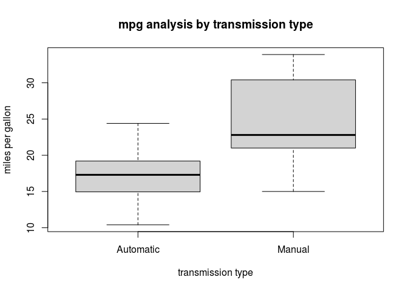

### Question

You work for *Motor Trend*, a magazine about the automobile industry.
Looking at a data set of a collection of cars, they are interested in
exploring the relationship between a set of variables and miles per
gallon (MPG) (outcome). They are particularly interested in the
following two questions:

-   “Is an automatic or manual transmission better for MPG”
-   "Quantify the MPG difference between automatic and manual
    transmissions"

### Quick answers

-   An manual transmission better for MPG
-   Weight and drive speed affect mpg
    -   Weight increase leads to mpg decrease
        -   With weight increase 1000 lbs, the mpg decease by about 4
            for automatic cars, and about 6 for manual cars
    -   Drive speed increase ledas to mpg increase
        -   With speed increase 1 second per 1/4 mile, the mpg increase
            about 0.8 for automatic cars, and about 1.4 for manual cars

### Enviroment settings

    library(car)

    ## Loading required package: carData

    data(mtcars)
    head(mtcars)

    ##                    mpg cyl disp  hp drat    wt  qsec vs am gear carb
    ## Mazda RX4         21.0   6  160 110 3.90 2.620 16.46  0  1    4    4
    ## Mazda RX4 Wag     21.0   6  160 110 3.90 2.875 17.02  0  1    4    4
    ## Datsun 710        22.8   4  108  93 3.85 2.320 18.61  1  1    4    1
    ## Hornet 4 Drive    21.4   6  258 110 3.08 3.215 19.44  1  0    3    1
    ## Hornet Sportabout 18.7   8  360 175 3.15 3.440 17.02  0  0    3    2
    ## Valiant           18.1   6  225 105 2.76 3.460 20.22  1  0    3    1

And each column class is following

    str(mtcars)

    ## 'data.frame':    32 obs. of  11 variables:
    ##  $ mpg : num  21 21 22.8 21.4 18.7 18.1 14.3 24.4 22.8 19.2 ...
    ##  $ cyl : num  6 6 4 6 8 6 8 4 4 6 ...
    ##  $ disp: num  160 160 108 258 360 ...
    ##  $ hp  : num  110 110 93 110 175 105 245 62 95 123 ...
    ##  $ drat: num  3.9 3.9 3.85 3.08 3.15 2.76 3.21 3.69 3.92 3.92 ...
    ##  $ wt  : num  2.62 2.88 2.32 3.21 3.44 ...
    ##  $ qsec: num  16.5 17 18.6 19.4 17 ...
    ##  $ vs  : num  0 0 1 1 0 1 0 1 1 1 ...
    ##  $ am  : num  1 1 1 0 0 0 0 0 0 0 ...
    ##  $ gear: num  4 4 4 3 3 3 3 4 4 4 ...
    ##  $ carb: num  4 4 1 1 2 1 4 2 2 4 ...

### EDA

There are 10 variables that may effect dependent variable `mpg`,we first
check the correlations

    cor(mtcars$mpg, mtcars[,-1])

    ##            cyl       disp         hp      drat         wt     qsec        vs
    ## [1,] -0.852162 -0.8475514 -0.7761684 0.6811719 -0.8676594 0.418684 0.6640389
    ##             am      gear       carb
    ## [1,] 0.5998324 0.4802848 -0.5509251

So that for the 10 independent variables - 5 may be positively related,
including drat, qsec, vs, am, gear - 5 may be negatively related,
including cyl, disp, hp, wt, carb

### Which transmission is better for MPG

We need to change `am` class from numeric to factor

Besides, check column meanings using `?mtcars`, we see am=0 denotes
automatic transmission, and am=1 for manual transmission

    mtcars$am = factor(mtcars$am)
    levels(mtcars$am) <- c("Automatic", "Manual")

Conclusion: A box plot with transmission type in x axis and mpg in y
axis shows that in genral, the **manual type autos drive more miles per
gallon.**

    boxplot(mtcars$mpg ~ mtcars$am, data = mtcars, xlab="transmission type", ylab="miles per gallon", main = "mpg analysis by transmission type")

### MPG difference between automatic and manual transmissions - Quantify analysis

    fit <-  step(lm(mpg ~ . , data = mtcars), trace = 0, steps = 10000)
    summary(fit)

    ## 
    ## Call:
    ## lm(formula = mpg ~ wt + qsec + am, data = mtcars)
    ## 
    ## Residuals:
    ##     Min      1Q  Median      3Q     Max 
    ## -3.4811 -1.5555 -0.7257  1.4110  4.6610 
    ## 
    ## Coefficients:
    ##             Estimate Std. Error t value Pr(>|t|)    
    ## (Intercept)   9.6178     6.9596   1.382 0.177915    
    ## wt           -3.9165     0.7112  -5.507 6.95e-06 ***
    ## qsec          1.2259     0.2887   4.247 0.000216 ***
    ## amManual      2.9358     1.4109   2.081 0.046716 *  
    ## ---
    ## Signif. codes:  0 '***' 0.001 '**' 0.01 '*' 0.05 '.' 0.1 ' ' 1
    ## 
    ## Residual standard error: 2.459 on 28 degrees of freedom
    ## Multiple R-squared:  0.8497, Adjusted R-squared:  0.8336 
    ## F-statistic: 52.75 on 3 and 28 DF,  p-value: 1.21e-11

So that we get 3 out of 10 independent variables of importance to mpg
change: wt, qsec, and am, with *R*2 = 0.85

Furthermore, we examine mpg ~ wt + qest correlation with am

    fit2 <- lm(mpg ~ am:wt + am:qsec, data = mtcars)
    summary(fit2)

    ## 
    ## Call:
    ## lm(formula = mpg ~ am:wt + am:qsec, data = mtcars)
    ## 
    ## Residuals:
    ##     Min      1Q  Median      3Q     Max 
    ## -3.9361 -1.4017 -0.1551  1.2695  3.8862 
    ## 
    ## Coefficients:
    ##                  Estimate Std. Error t value Pr(>|t|)    
    ## (Intercept)       13.9692     5.7756   2.419  0.02259 *  
    ## amAutomatic:wt    -3.1759     0.6362  -4.992 3.11e-05 ***
    ## amManual:wt       -6.0992     0.9685  -6.297 9.70e-07 ***
    ## amAutomatic:qsec   0.8338     0.2602   3.205  0.00346 ** 
    ## amManual:qsec      1.4464     0.2692   5.373 1.12e-05 ***
    ## ---
    ## Signif. codes:  0 '***' 0.001 '**' 0.01 '*' 0.05 '.' 0.1 ' ' 1
    ## 
    ## Residual standard error: 2.097 on 27 degrees of freedom
    ## Multiple R-squared:  0.8946, Adjusted R-squared:  0.879 
    ## F-statistic: 57.28 on 4 and 27 DF,  p-value: 8.424e-13

With total *R*2 of 90%, all the coefficients are significant,
and we have the following conclusions

-   Weight increase leads to mpg decrease
    -   With weight increase 1000 lbs, the mpg decease by about 4 for
        automatic cars, and about 6 for manual cars
-   Drive speed increase ledas to mpg increase
    -   With speed increase 1 second per 1/4 mile, the mpg increase
        about 0.8 for automatic cars, and about 1.4 for manual cars
