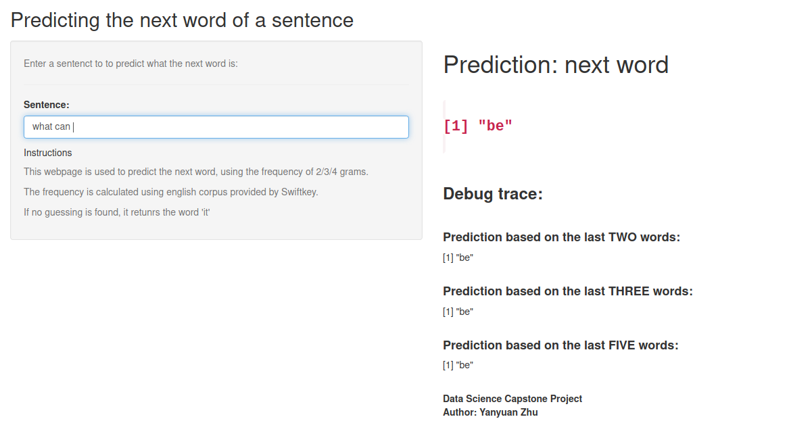

```{r setup, include=FALSE}
knitr::opts_chunk$set(echo = FALSE)
```

## Introduction

- The application **Predicting Next Word in a Sentence** aims at showing the model of NLP created during the Data Science Capstone Project course.

- The course is developed by the Johns Hopkins University, avaiable in Coursera.org

- The application uses english text data collected by SwiftKey.

## NLP Model

- **Predict Next Word** of a sentence, using the distribution frequency of 2, 3, and 4 grams

- The frequency is calculated using the **english text data from SwiftKey**

- In case no result is found by the model, it outputs a "it"

## Performance
- Data source: 2.5 million of text lines, with size of 550 Mbs, including blogs, tiwtters, and news

- Sampling: takes 10% random lines to calculate frequency tables with the combination of 2, 3, and 4 words

- Time: the app requires about 0.3 seconds to search the next word in the frequency table

## Application

- The shiny application is hosted on

https://caoanroad4800.shinyapps.io/Next_Word/

- And souce code is hosted on

https://github.com/caoanroad4800/datasciencecoursera/tree/master/10_Capstone_Project/Next_Word

- This final report is hosted on

https://caoanroad4800.github.io/datasciencecoursera/Final_Report.html

## How to use the application

- Open the application webpage, enter the sentence you want, and the app shows the next word that is of your interest.

```{r, echo=FALSE, fig.cap="Application Use Introduction", out.width = '50%'}

```


## 

```{r, echo=FALSE, out.width = '100%'}

```
