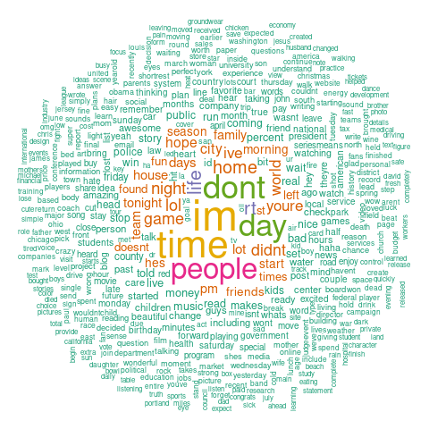
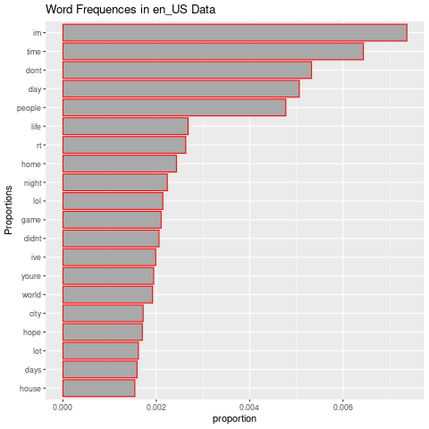
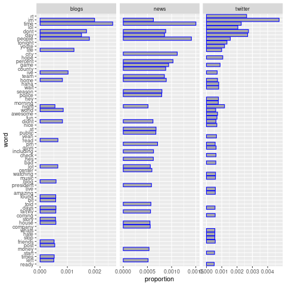
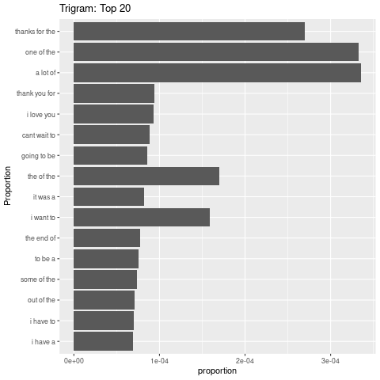

```{r setup, include=FALSE}
knitr::opts_chunk$set(echo = TRUE)
```

## Introduction

The project aims at building a NLP model to predict n-grams. The model shall be embedded into a Shiny App. 

This Milestone Report relates to exploratory data analysis regarding the data of <a href = "https://d396qusza40orc.cloudfront.net/dsscapstone/dataset/Coursera-SwiftKey.zip"> HC Corpora Dataset</a>.

## File summary
The data contains 4 languages (Deutsch, Finnish, Russian and English), each language has 3 sources of input (blogs, news, and twitter), with a tree-like structure as follows
```{r echo=FALSE}
my_tree <- readRDS("data/my_tree.RDS")
my_tree
```

And each input has some lines of words. In sum, there are about 4.3 million line (sentences) of English data, which could be used.
```{r echo=FALSE}
length_df <- readRDS("data/length_df.RDS")
length_df
```
And the total size, e.g. the english data, is about 550 Mb
```{r echo=FALSE}
size_df <- readRDS("data/size_df.RDS")
size_df
```
We are dealing with ~102 Million word counts
```{r echo=FALSE}
words_df <- readRDS("data/words_df.RDS")
words_df
```
## N-grams Frequency Analysis
A visualized, uni-gram word cloud is 



Accordingly, the uni-gram word frequency is 



The uni-grams by source (blogs, news, and twitter) are as follows. 



The tri-grams is 



## Prediction Model: Preliminary Thoughts

The plan is to use the N-grams as the basis for prediction. The use case is: when the use input a word, the model finds the bi-gram/tri-gram even 4-grams with the greatest relative probability accordingly, and show the words to user as candidate. 